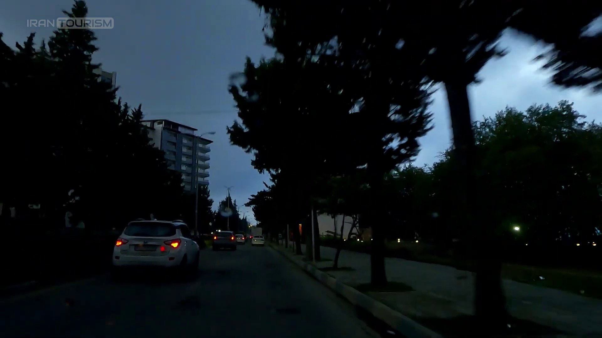

# MWCD (Multi Weather Conditions Dataset for Autonomous Driving)

This repository contains a comprehensive dataset of **5,765 high-resolution images (1920x1080)** with meticulously annotated **2D bounding boxes**, designed for object detection in autonomous driving systems under various weather conditions.

## Dataset Overview

- **Total Images**: 5,765
- **Image Resolution**: 1920x1080
- **Annotations**: 2D bounding boxes
- **Object Classes**:
  - Person
  - Bicycle
  - Car
  - Motorcycle
  - Bus
  - Truck
  - Traffic Light

## Weather Conditions Covered
- Day
- Night
- Rain
- Fog
- Snow
- Sand

## Geographic Diversity
The dataset includes images collected from diverse locations to ensure a wide range of object instances:
- **Tehran, Iran**
- **The Netherlands** (focus on bicycles)
- **Ho Chi Minh City, Vietnam** (focus on motorcycles)

## Example Images

Below are some example images from the MWCD dataset for autonomous driving:

  
*Daytime Image Example*

  
*Nighttime Image Example*

  
*Rainy Weather Image Example*

  
*Snowy Weather Image Example*

## Dataset Structure

```
/MWCD
  /images
    /train
    /val
  /annotations
    /train
    /val
```

## Download the Dataset

You can download the full MWCD dataset from the following link:  
After the publication of the article, the dataset will be publicly available
](https://drive.google.com/file/d/1ISJ-ddJCClZslG36nV-MUwAsksmRyEcO/view?usp=sharing)

## Usage Instructions

1. Clone this repository:
   ```bash
   git clone https://github.com/ehsanDL/MWCD.git
   ```
2. The dataset can be used with popular object detection frameworks like YOLO. Ensure the annotations are in the correct format.

## License

ehsan.madadi.jsu@gmail.com
```

